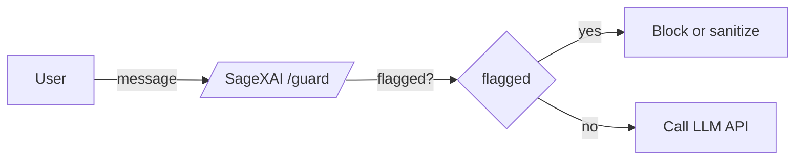
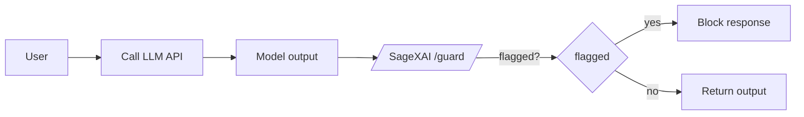

There are two common ways to integrate **/guard**:

### 1) Pre‑LLM (block input)

- Send the **user message** to `/api/v1/guard` **before** calling your LLM provider.
- If `flagged: true`, **block** or **sanitize** the input and show a user‑friendly message.
- If not flagged, forward the original message to the LLM.



### 2) Post‑LLM (block output)

- Call your LLM provider first.
- Send the **LLM output** to `/api/v1/guard`.
- If `flagged: true`, **block** returning the output and show a safe alternative.



<Callout>
SageXAI does not automatically block requests. You decide how to handle `flagged` results (block, sanitize, route to a human, etc.).
</Callout>

### Example: minimal pre‑LLM gate (Node.js)

```ts
const res = await fetch(`${BASE}/api/v1/guard`, { method: 'POST', headers, body: JSON.stringify({ messages: [{ role: 'user', content }], payload: true }) });
const scan = await res.json();
if (scan.flagged) {
  return { error: 'Your message was blocked by safety policies.', details: scan.payload };
}
// else: call LLM
```